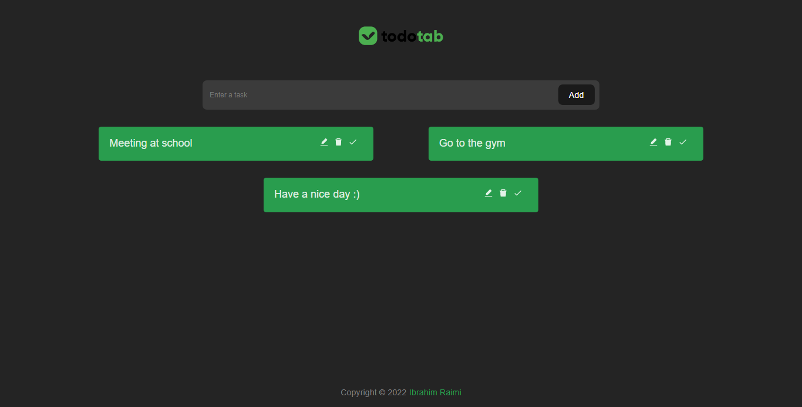

# Todo Tab

Todotab is a simple tool to organise everything.

<div>
   

# Live version

[Live Version](https://todotab.vercel.app/)

## Feedback and Bugs

If you have any feedback or bug report, please feel free to raise an issue :)

<!-- //TODO: Create Installation guide  -->

## Contributing

If you would like to contribute to this amazing project, you can create a Pull Request containing your proposed changes and we will review it. Please check our [contributing guildelines](CONTRIBUTING.md) first. Thank you.

## Code of Conduct

Before interacting with our community, please read our [Code of Conduct](CODE_OF_CONDUCT.md).

## Getting Started

To get a local copy up and running follow these simple steps.

### Installation

_Below is an example of how you can instruct your audience on installing and setting up your app. This template doesn't rely on any external dependencies or services._

1. Clone the repo
   ```sh
   git clone https://github.com/ibrahimraimi/todo-tab
   ```
1. Install NPM packages
   ```sh
   npm install
   ```
1. Run the local server
   ```sh
   npm run dev
   ```

## Licensing

Copyright (C) 2022 Ibrahim Raimi

This program is free software: you can redistribute it and/or modify it under the terms of the GNU Affero General Public License as published by the Free Software Foundation.

The GNU Affero General Public License is a free, copyleft license for software and other kinds of works, specifically designed to ensure cooperation with the community, and this program is distributed in the hope that it will be useful, but **WITHOUT ANY WARRANTY;** without even the implied warranty of **MERCHANTABILITY or FITNESS FOR A PARTICULAR PURPOSE**. See the GNU Affero General Public License for more details.

The full license terms may be viewed in the [LICENSE.md file](./LICENSE.md)

## Contact

We can be contacted through our [Discord Server](https://discord.com) or via twitter [@ibrahimraimi\_](https://twitter.com/ibrahimraimi_)
